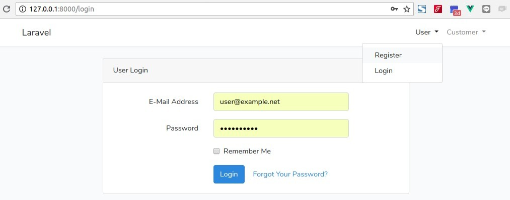
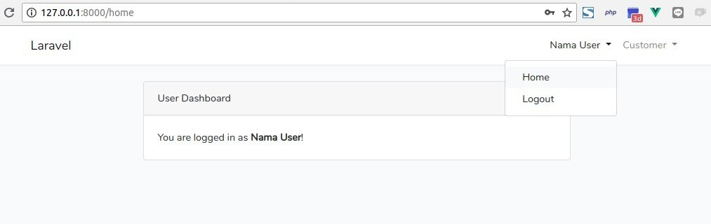
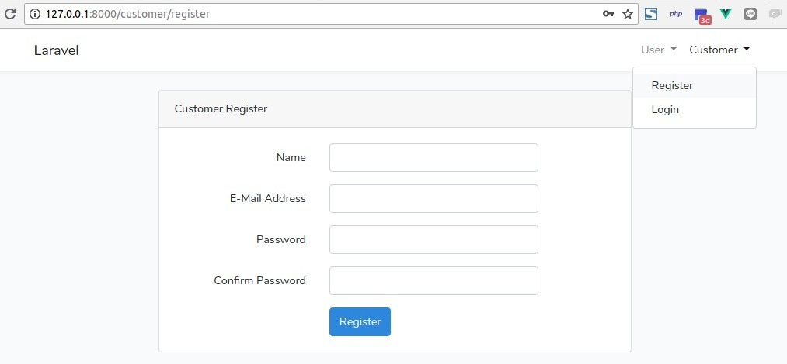
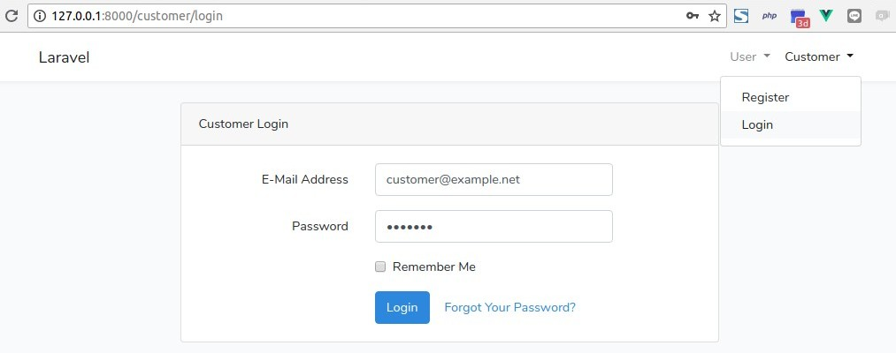
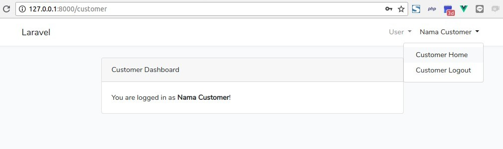

# Laravel multi-table Auth

Laravel 5.6 example with multi-table Authentication. Built with Test-driven Development.

<br>

## Getting Started
This application can be installed on local server and online server with these specifications :

#### Server Requirements
1. PHP >= 7.1.3 (and meet [Laravel 5.6 server requirements](https://laravel.com/docs/5.6#server-requirements)),
2. MySQL or MariaDB database,
3. SQlite (for automated testing).

#### Installation Guide

```bash
# Clone the repo
$ git clone https://github.com/nafiesl/laravel-multi-table-auth.git

# cd into project directory
$ cd laravel-multi-table-auth

# Install dependecies
$ composer install # or composer update

# Set create env file
$ cp .env.example .env
$ php artisan key:generate
```

- Create new MySQL database for this application
- Set database credentials on `.env` file

```bash
# Migrate the database structire
$ php artisan migrate

# Start web server
$ php artisan serve
```

- Register as **new User** and **new Customer**, then login as separated authentication guard.

<br>

## Screenshots

#### User Login Page



#### User Dashboard Page



#### Customer Register Page



#### Customer Login Page



#### Customer Dashboard Page



## License

This project is free and open-source under [MIT License](LICENSE).
